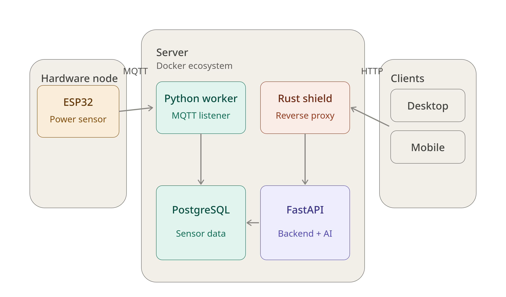

# ⚡ NetHome - AI-Powered IoT Energy Monitoring System

NetHome is a complete, offline-first IoT architecture designed for real-time energy monitoring, smart home automation, and data privacy. It features a scalable microservices architecture that connects hardware nodes with a **Natural Language AI Engine**, allowing users to control their physical environment through voice commands.


---

## 🎯 Business Value & Use Case

Traditional smart home apps rely on third-party cloud servers, causing high latency, privacy risks, and dependency on active internet connections. **NetHome solves this by processing all data and AI decision-making locally**, on a self-hosted edge server.

This project demonstrates a production-ready approach to IoT data ingestion, real-time analytics, and AI-driven automation — a pattern applicable to industrial IoT, smart agriculture, or secure residential environments.

## 🧠 Core Features

* **AI Voice Automation:** Processes natural language commands (e.g., *"Turn on the water heater during off-peak hours"*) and automatically toggles physical relays via MQTT.
* **Real-Time Energy Analytics:** Tracks Power (W) and Energy (kWh) from PZEM-004T sensors, calculating real costs based on configurable electricity tariffs.
* **100% Offline Capable:** The entire ecosystem runs on a local edge server (Ubuntu + Docker), with zero data leaving the network.
* **Custom Security Shield:** Includes a high-performance HTTP reverse proxy and rate limiter built from scratch in **Rust** to protect the API from overloads and unauthorized access.
* **Cross-Platform Client:** Native-feel mobile application built with Kotlin Multiplatform + Jetpack Compose.

## 🏗️ Architecture

 

**Data Flow:**
1. **Hardware Telemetry:** `ESP32 (MQTT)` ➔ `Mosquitto Broker` ➔ `Python Worker` ➔ `PostgreSQL`.
2. **Client Interaction:** `Kotlin App` ➔ **`Rust Reverse Proxy`** ➔ `FastAPI`. 
The AI engine sits on top of the API to translate voice commands into MQTT actions.

## 🛠️ Tech Stack

| Layer | Technology |
|---|---|
| **Mobile App** | Kotlin Multiplatform, Jetpack Compose |
| **Security & Routing** | **Rust** (Custom Reverse Proxy & Rate Limiter) |
| **Backend API** | Python, FastAPI, Uvicorn |
| **MQTT Worker** | Python, Paho-MQTT |
| **Message Broker** | Eclipse Mosquitto |
| **Database** | PostgreSQL, SQLAlchemy |
| **Edge Hardware** | C++ (ESP32), PZEM-004T sensors |
| **Infrastructure** | Docker, Docker Compose |

---

## 🚀 Deployment & Simulation

The entire infrastructure is fully containerized. You don't need to install local databases or brokers — Docker handles the entire ecosystem.

### 1. Clone the repository
```bash
git clone [https://github.com/YOUR_USERNAME/nethome-iot.git](https://github.com/YOUR_USERNAME/nethome-iot.git)
cd nethome-iot